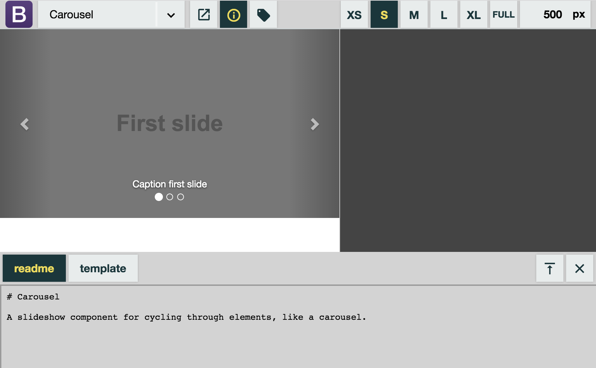

# Demo viewer

**Preview components in isolation with documentation, annotations and breakpoint controls.**

[](https://www.npmjs.com/package/demo-viewer)
[](https://github.com/semantic-release/semantic-release)

The demo-viewer is a single page web app with a large viewport to view your modules, controlled via a toolbar at the top.
You can use the toolbar to select modules, control the viewport size and open the info panel for the current module:



## Live demos

* [Bootstrap v3 with config in HTML file](https://voorhoede.github.io/demo-viewer/examples/bootstrap-v3/) ([template](examples/bootstrap-v3/index.html))
* [Bootstrap v3 with config in external JSON file](https://voorhoede.github.io/demo-viewer/examples/bootstrap-v3/index-json.html) ([template](examples/bootstrap-v3/index-json.html), [external config](examples/bootstrap-v3/modules.json))


## Install

The demo-viewer and can be installed via [npm](https://npmjs.org/):

```bash
npm install --save-dev demo-viewer
```

Alternatively you can simply [download a copy](releases/).


## Usage

### Setup

To use the demo viewer create an HTML page with:

* `<demo-viewer></demo-viewer>` tag to mount viewer on.
* `<link rel="stylesheet" href="path/to/demo-viewer.css">` to include demo viewer styles.
* `<script src="path/to/demo-viewer.js"></script>` to include demo viewer behaviour.
* `<script>window.demoViewer({ /* options */ });</script>` to initialise the viewer.
* Configure the demo viewer via [`options`](#options).

Example boilerplate:

```html
<!doctype html>
<html lang="en">
<head>
    <meta charset="utf-8">
    <meta name="viewport" content="width=device-width, initial-scale=1">
    <title>Demo viewer</title>
</head>
<body>
	<demo-viewer></demo-viewer>

	<link rel="stylesheet" href="node_modules/demo-viewer/dist/demo-viewer.css">
	<script src="node_modules/demo-viewer/dist/demo-viewer.js"></script>

	<script>window.demoViewer({ /* options */ });</script>
</body>
</html>
```

### Options

The demo viewer can be configured through an options object:

```javascript
demoViewer({ modules, sizes, logo })
```

#### modules

Type: `String` or `Object[]`

Modules are data objects describing the UI components you wish to display in the demo viewer.

Each module has:

* `name` [`String`] displayed in the module selector on the top-left of the demo viewer.
* `url` [`String`] of the demo page of the component.
* `group` [`String`] *(optional)* to cluster modules by in module selector.
* `info` [`Object`] *(optional)* map of info files as `label:url` pairs.

The modules can be configured inline using the `Object[]` notation or in an external file using the URL / filename (`String`) as `modules` value.

**Example of basic configuration inline:**

```javascript
demoViewer({
	modules: [
        { name: 'Login form',        url: 'demo/auth/login-form' },
        { name: 'Password strength', url: 'demo/auth/password-strength' },
        { name: 'Alerts',            url: 'demo/core/alerts' },
        { name: 'Buttons',           url: 'demo/core/buttons' },
    ]
})
```

**Example of basic configuration in external file:**

```javascript
demoViewer({
	modules: 'modules.json'
})
```
`modules.json`:
```json
[
	{ "name": "Login form",        "url": "demo/auth/login-form" },
	{ "name": "Password strength", "url": "demo/auth/password-strength" },
	{ "name": "Alerts",            "url": "demo/core/alerts" },
	{ "name": "Buttons",           "url": "demo/core/buttons" },
]
```

**Example of modules clustered into groups:**

```json
[
	{ "group": "Auth", "name": "Login form",        "url": "demo/auth/login-form" },
	{ "group": "Auth", "name": "Password strength", "url": "demo/auth/password-strength" },
	{ "group": "Core", "name": "Alerts",            "url": "demo/core/alerts" },
	{ "group": "Core", "name": "Buttons",           "url": "demo/core/buttons" },
]
```

**Example of module with info:**

```json
[
	{
		"group": "Auth",
		"name": "Login form",
		"url": "demo/auth/login-form",
		"info": {
			"readme": "demo/auth/README.md",
			"template": "demo/auth/template.html"
		}
	},
	...
]
```

Note: `"readme"` and `"template"` are just examples. You can use any label you like. The related URL is opened info panel.

#### sizes

Type: `Object[]` *(optional)*

Sizes are named predefined viewport widths. The size controls in the top-right of the demo viewer let users easily switch between these sizes.

Each size has:

* `name` [`String`] used as button text in size controls.
* `width` [`Number`] of the viewport when active.

**Example:**

```javascript
demoViewer({
	sizes: [
    	{ name: 'XS', width: 320 },
    	{ name: 'S', width: 500 },
	    { name: 'M', width: 750 },
    	{ name: 'L', width: 1020 }
	]
})
```

#### logo

Type: `String` *(optional)*

You can brand the demo viewer with a custom logo by setting `logo` to an image URL.

**Example:**

```javascript
demoViewer({
	logo: '/assets/logo-twbs.png'
})
```

Note: If you'd like to customise appearance further you can replace `demo-viewer.css` with your own. You can copy and modify the styles from the [source code](src/) ([main CSS file](src/index.css)).


## Contributing

Contributions are always welcome. See [CONTRIBUTING.md](CONTRIBUTING.md) for [guidelines](CONTRIBUTING.md#guidelines) and [development scripts](CONTRIBUTING.md#scripts).


## License

[MIT licensed](LICENSE) © [De Voorhoede](https://www.voorhoede.nl/)
